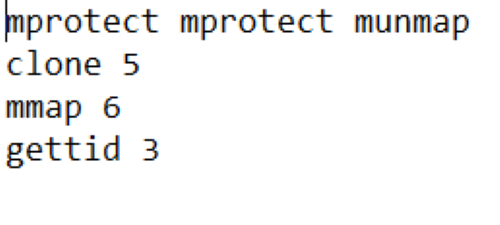

# Access Control System for system calls

## Table of Contents

- [Access Control System for system calls](#access-control-system-for-system-calls)
  - [Table of Contents](#table-of-contents)
  - [Introduction](#introduction)
  - [Implementation](#implementation)
  - [Instructions File format](#instructions-file-format)
  - [Instructions File example](#instructions-file-example)
  - [Uploaded Files](#uploaded-files)
  - [Execution Instructions](#execution-instructions)

## Introduction

This access control system for system calls was developed using the C programming language. \
It restricts an executable (tracee) from invoking a large number of system calls within a short period of time. \
It receives as input a text file with instructions, as well as an executable to monitor. \
The instructions file should contain the names of the restricted system calls along with the number of times \
they can be called within one second. \
Access control is enabled only if a sequence of system calls is found anywhere in the executable (tracee).

## Implementation

In order to create this system we used:

- fork, in order to execute and monitor the executable given as an input
- ptrace , for the observation and control of the executable given as an input. \
  See more about ptrace [here](https://man7.org/linux/man-pages/man2/ptrace.2.html)

In order to use the system you should give as input:

- instruction file, in order to give instructions to the system about \
  which sequence of system calls it should search for and which system calls should be restricted
- the executable you want to monitor

## Instructions File format

The instructions file, given as an input to the system, should contain the names of system calls \
and the number of times they can be called within one second. For example, if the input file \
contains the line “gettid 5” then the tracee is not allowed to call the gettid system call more than \
5 times per second. The first line of the instructions file should be a sequence of system calls. \
This sequence will be used as a trigger in order to enable the access control system. The system \
will constantly monitor system calls but the access control component will be enabled only if this \
sequence is found anywhere in the tracee. An example of an instructions file can be found in the \
next section. The system does not use a parser for the instructions file. We  assume that the input file \
is always correct and with valid information.

## Instructions File example

## Uploaded Files

- Directory files contains some instruction files.
- acs.c and acs.h contain the functionality for the access control system and \
input_exec.c the code for the executable which will be monitored by the access control system.

## Execution Instructions

- Run "make all" to compile the access control system and the test program. \
  There will be generated the acs_exec (access control system) and the input_exec (test program) \
  which will be given as an input to the access control system.
- Run "./acs_exec input_exec file" to execute the program.
